A Pragmatic Look at Deep Imitation Learning
===========================================
[](LICENSE.md)

Imitation learning algorithms (with PPO [[1]](#references)):

- ~~ABC [[2]](#references)~~
- AIRL [[3]](#references)
- BC [[4]](#references)
- DRIL [[5]](#references)
- FAIRL [[6]](#references)
- GAIL [[7]](#references)
- GMMIL [[8]](#references)
- nn-PUGAIL [[9]](#references)
- ~~PWIL [[10]](#references)~~
- RED [[11]](#references)


Requirements
------------
The code runs on Python3. You can install most of the requirements by running `pip install -r requirements.txt`(to be added). Notable required packages are PyTorch, OpenAI gym, and [D4RL-pybullet](https://github.com/takuseno/d4rl-pybullet)

Run
---

```
python main.py --imitation [AIRL|BC|DRIL|FAIRL|GAIL|GMMIL|PUGAIL|RED]
```

Options include:

- State-only imitation learning: `--state-only`
- Absorbing state indicator [[12]](#references): `--absorbing`
- R1 gradient regularisation [[13]](#references): `--r1-reg-coeff 1` (default)

Results
-------

**PPO**

Train | Test
:----:|:---:
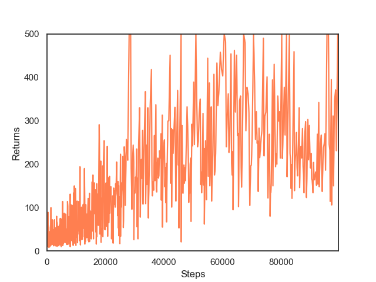 | 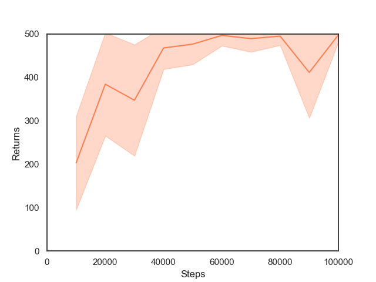

**AIRL**

Train | Test
:----:|:---:
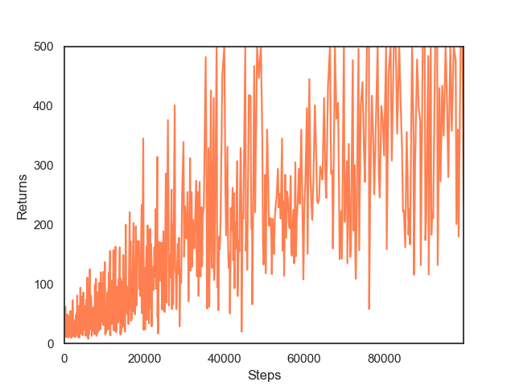 | 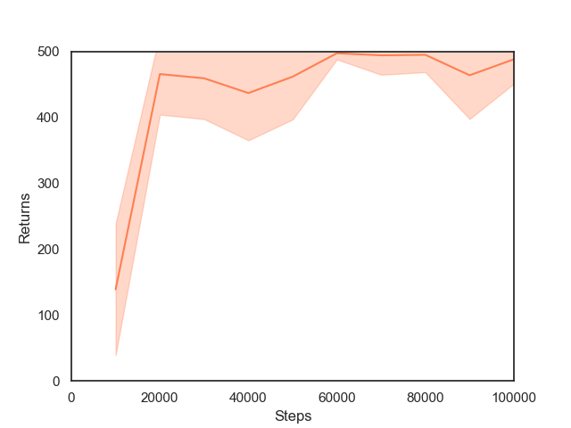

**BC**

Train | Test
:----:|:---:
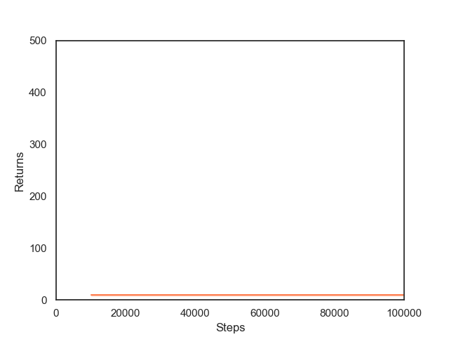 | 

**DRIL**

Train | Test
:----:|:---:
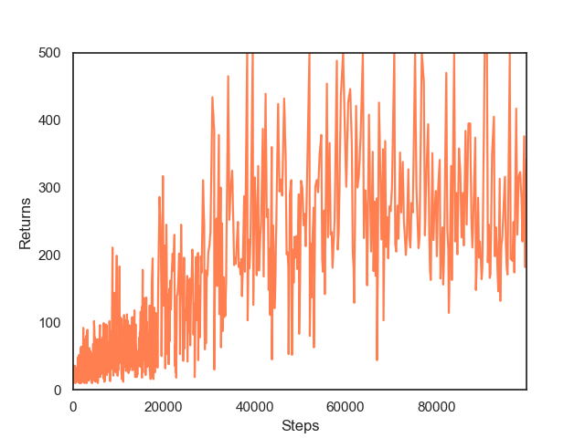 | 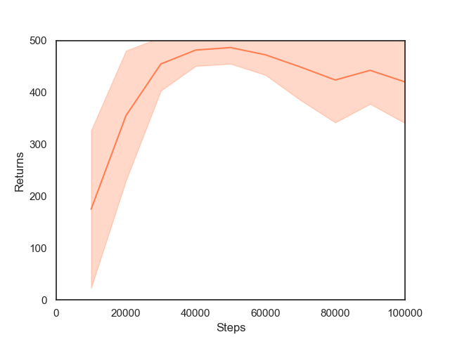

**FAIRL**

Train | Test
:----:|:---:
 | 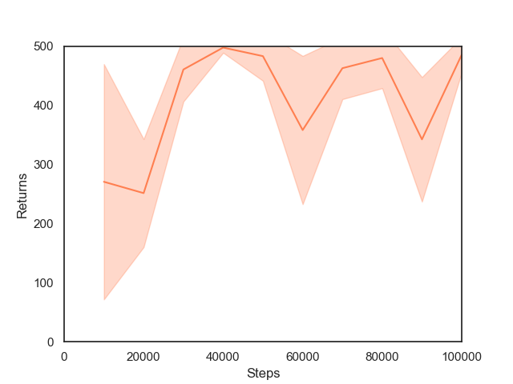

**GAIL**

Train | Test
:----:|:---:
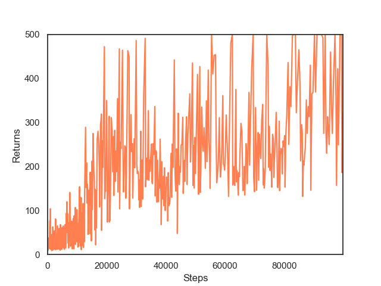 | 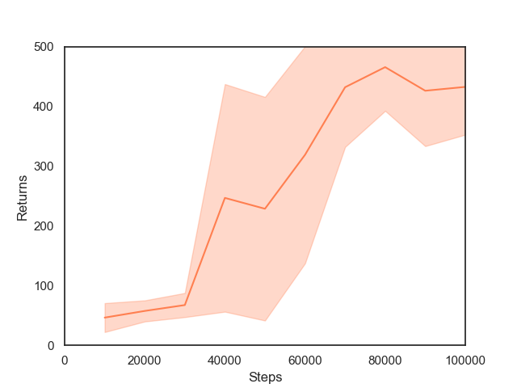

**GMMIL**

Train | Test
:----:|:---:
 | 

**nn-PUGAIL**

Train | Test
:----:|:---:
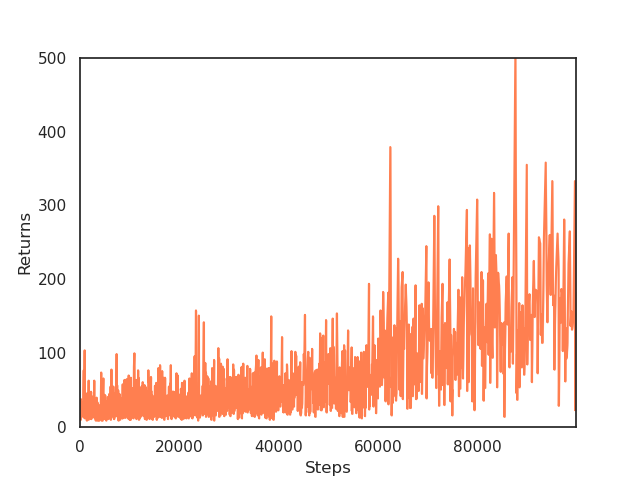 | 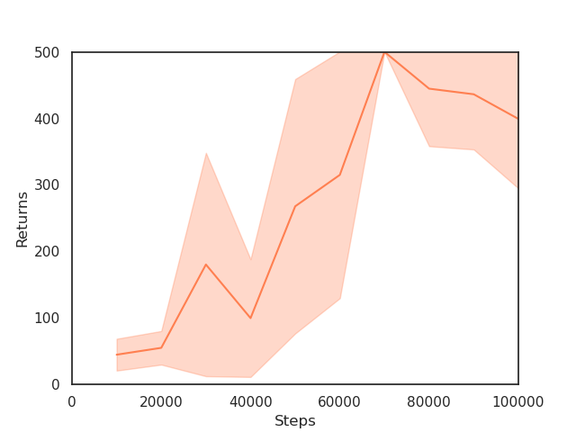

**RED**

Train | Test
:----:|:---:
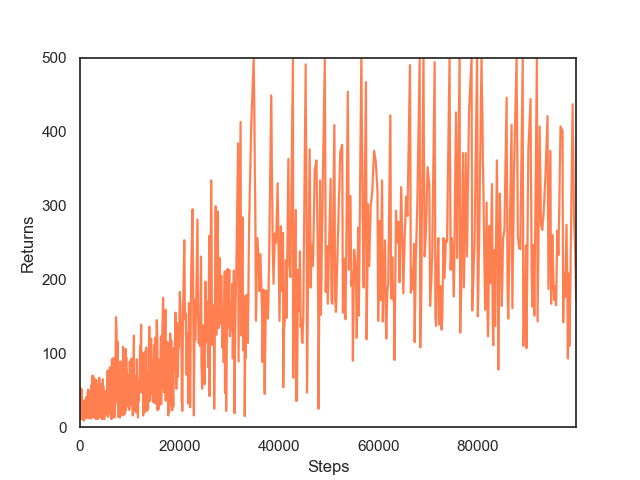 | 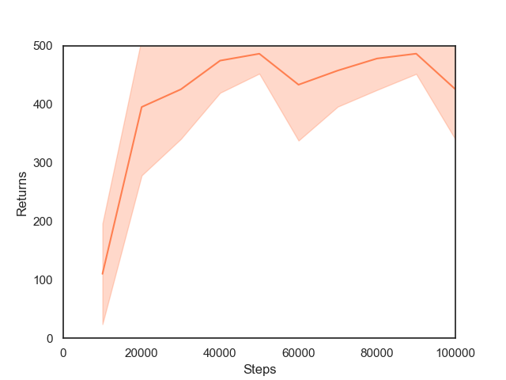

Acknowledgements
----------------

- [@ikostrikov](https://github.com/ikostrikov) for [https://github.com/ikostrikov/pytorch-a2c-ppo-acktr-gail](https://github.com/ikostrikov/pytorch-a2c-ppo-acktr-gail)

Citation
--------

If you find this work useful and would like to cite it, the following would be appropriate:

```
@misc{arulkumaran2020pragmatic,
  author = {Arulkumaran, Kai},
  title = {A Pragmatic Look at Deep Imitation Learning},
  url = {https://github.com/Kaixhin/imitation-learning},
  year = {2020}
}
```

References
----------

[1] [Proximal Policy Optimization Algorithms](https://arxiv.org/abs/1707.06347)  
[2] [Adversarial Behavioral Cloning](https://www.tandfonline.com/doi/abs/10.1080/01691864.2020.1729237)  
[3] [Learning Robust Rewards with Adversarial Inverse Reinforcement Learning](https://arxiv.org/abs/1710.11248)  
[4] [Efficient Training of Artificial Neural Networks for Autonomous Navigation](https://www.mitpressjournals.org/doi/abs/10.1162/neco.1991.3.1.88?journalCode=neco)  
[5] [Disagreement-Regularized Imitation Learning](https://openreview.net/forum?id=rkgbYyHtwB)  
[6] [A Divergence Minimization Perspective on Imitation Learning Methods](https://arxiv.org/abs/1911.02256)  
[7] [Generative Adversarial Imitation Learning](https://arxiv.org/abs/1606.03476)  
[8] [Imitation Learning via Kernel Mean Embedding](https://www.aaai.org/ocs/index.php/AAAI/AAAI18/paper/viewPaper/16807)  
[9] [Positive-Unlabeled Reward Learning](https://arxiv.org/abs/1911.00459)  
[10] [Primal Wasserstein Imitation Learning](https://arxiv.org/abs/2006.04678)  
[11] [Random Expert Distillation: Imitation Learning via Expert Policy Support Estimation](https://arxiv.org/abs/1905.06750)  
[12] [Discriminator-Actor-Critic: Addressing Sample Inefficiency and Reward Bias in Adversarial Imitation Learning](https://arxiv.org/abs/1809.02925)  
[13] [Which Training Methods for GANs do actually Converge?](https://arxiv.org/abs/1801.04406)  
