IL
==
[](LICENSE.md)

Imitation learning algorithms (with PPO [[1]](#references)):

- ~~ABC [[2]](#references)~~
- AIRL [[3]](#references)
- BC [[4]](#references)
- GAIL [[5]](#references)
- GMMIL [[6]](#references)
- ~~InfoGAIL [[7]](#references)~~
- ~~RED [[8]](#references)~~

```
python main.py --imitation [AIRL|BC|GAIL|GMMIL]
```

Results
-------

**PPO**

Train | Test
:----:|:---:
 | 

**AIRL(s, a)**

Train | Test
:----:|:---:
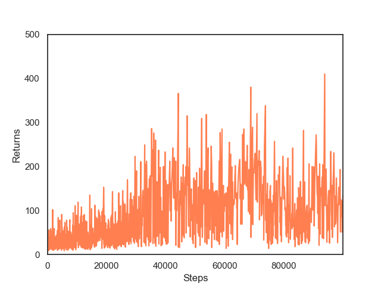 | 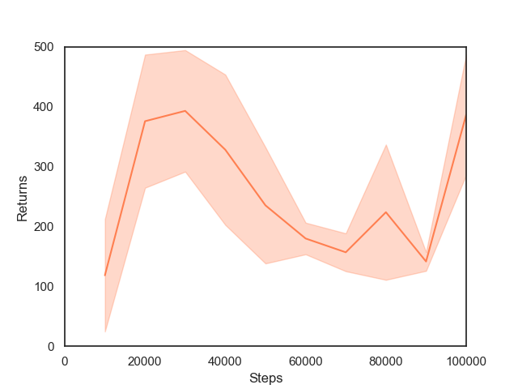

**AIRL(s)**

Train | Test
:----:|:---:
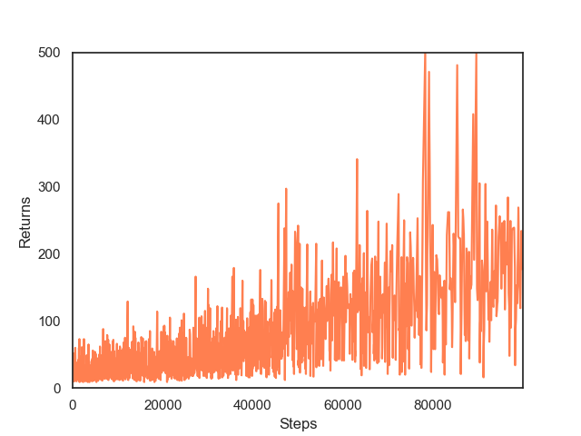 | 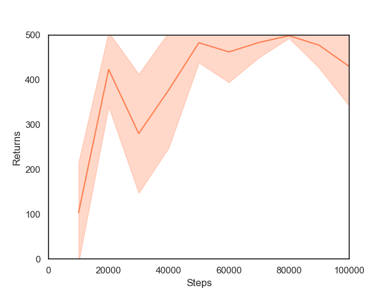

**BC**

Train | Test
:----:|:---:
 | 

**GAIL(s, a)**

Train | Test
:----:|:---:
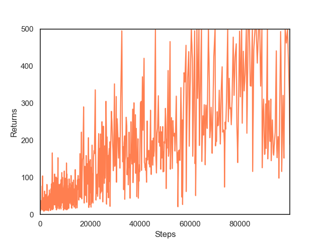 | 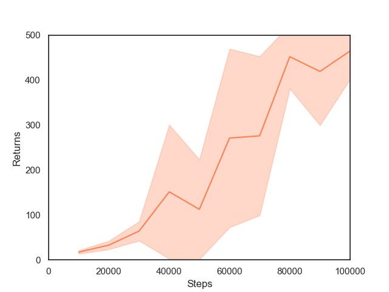

**GAIL(s)**

Train | Test
:----:|:---:
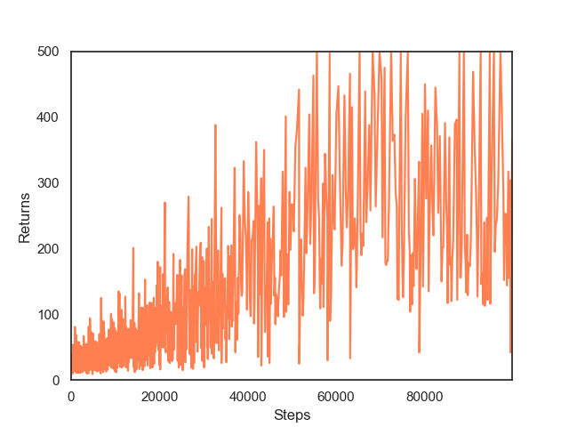 | 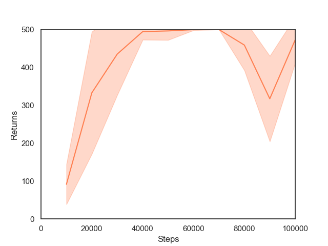

**GMMIL(s, a)**

Train | Test
:----:|:---:
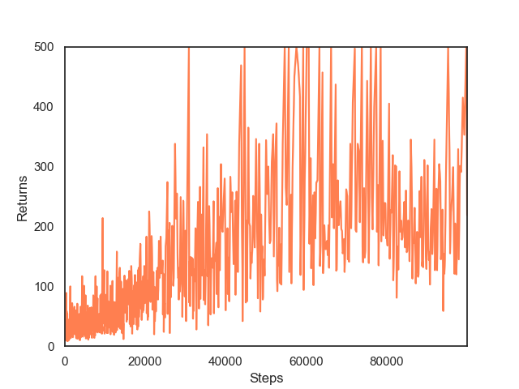 | 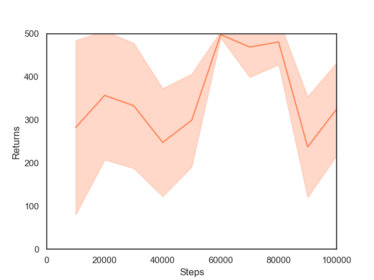

**GMMIL(s)**

Train | Test
:----:|:---:
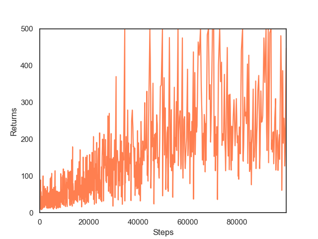 | 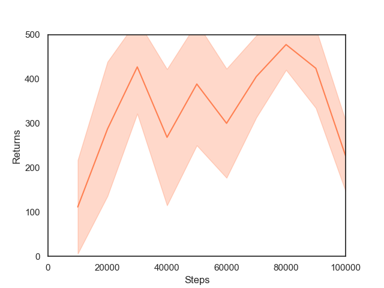

Acknowledgements
----------------

- [@ikostrikov](https://github.com/ikostrikov) for [https://github.com/ikostrikov/pytorch-a2c-ppo-acktr-gail](https://github.com/ikostrikov/pytorch-a2c-ppo-acktr-gail)

References
----------

[1] [Proximal Policy Optimization Algorithms](https://arxiv.org/abs/1707.06347)  
[2] [Adversarial Behavioral Cloning](https://www.tandfonline.com/doi/abs/10.1080/01691864.2020.1729237)  
[3] [Learning Robust Rewards with Adversarial Inverse Reinforcement Learning](https://arxiv.org/abs/1710.11248)  
[4] [Efficient Training of Artificial Neural Networks for Autonomous Navigation](https://www.mitpressjournals.org/doi/abs/10.1162/neco.1991.3.1.88?journalCode=neco)  
[5] [Generative Adversarial Imitation Learning](https://arxiv.org/abs/1606.03476)  
[6] [Imitation Learning via Kernel Mean Embedding](https://www.aaai.org/ocs/index.php/AAAI/AAAI18/paper/viewPaper/16807)  
[7] [InfoGAIL: Interpretable Imitation Learning from Visual Demonstrations](https://arxiv.org/abs/1703.08840)  
[8] [Random Expert Distillation: Imitation Learning via Expert Policy Support Estimation](https://arxiv.org/abs/1905.06750)  
