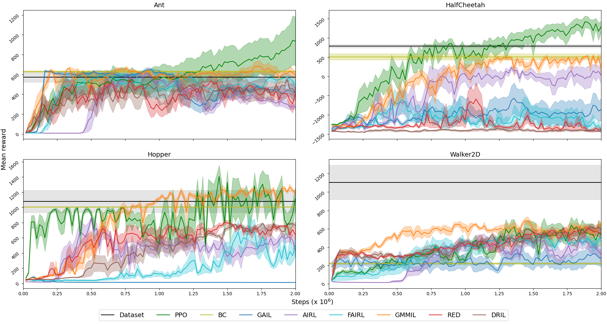

# A Pragmatic Look at Deep Imitation Learning

[](LICENSE.md)

Imitation learning algorithms (using SAC [[HZA18, HZH18]](#references) as the base RL algorithm):

- AdRIL [[SCB21]](#references)
- DRIL [[BSH20]](#references) (dropout version; with BC auxiliary loss, default true)
- GAIL [[HE16]](#references) (a.k.a. DAC/SAM when using an off-policy algorithm [[KAD18, BK18]](#references))
- GMMIL [[KP18]](#references)
- PWIL [[DHG20]](#references) (with mix of expert data, default true) TODO: This should be seeded ER, not mix
- RED [[WCA19]](#references)

General options include:

- BC [[P91]](#references) (pre)training: `bc_pretraining.iterations: >= 0`
- State-only imitation learning: `imitation.state-only: true/false`
- Absorbing state indicator [[KAD18]](#references): `imitation.absorbing: true/false`
- Training on a mix of agent and expert data: `imitation.mix_expert_data: true/false`
- BC auxiliary loss: `imitation.bc_aux_loss: true/false`

DRIL, GAIL and RED include several options for their trained discriminators.

AdRIL options include:

- Balanced sampling: `imitation.balanced: true/false` (alternate sampling expert and agent data batches vs. mixed batches)
- Discriminator update frequency: `imitation.update_freq: >= 0` (set to 0 for SQIL [[RDL19]](#references))

GAIL options include:

- Reward shaping (AIRL) [[FLL17]](#references): `imitation.model.reward_shaping: true/false`
- Subtract log π(a|s) (AIRL) [[FLL17]](#references): `imitation.model.subtract_log_policy: true/false`
- Reward functions (GAIL/AIRL/FAIRL) [[HE16, FLL17, GZG19]](#references): `imitation.model.reward_function: AIRL/FAIRL/GAIL`
- Gradient penalty [[KAD18, BK18]](#references): `imitation.grad_penalty: >= 0`
- Spectral normalisation [[BSK20]](#references): `imitation.spectral_norm: true/false`
- Entropy bonus [[ORH21]](#references): `imitation.entropy_bonus: >= 0`
- Loss functions (BCE/Mixup/nn-PUGAIL) [[HE16, CNN20, XD19]](#references): `imitation.loss_function: BCE/Mixup/PUGAIL`
- Additional hyperparameters for the loss functions: `imitation.mixup_alpha: >= 0`, `imitation.pos_class_prior: >= 0, <= 1`, `imitation.nonnegative_margin: >= 0`

PWIL options include:

- Reward scale α: `imitation.reward_scale: >= 0`
- Reward bandwidth scale β: `imitation.reward_bandwidth_scale: >= 0`

RED options include:

- Reward bandwidth scale σ1: `imitation.reward_bandwidth_scale: >= 0`

Benchmarked on [Gym MuJoCo environments](https://www.gymlibrary.dev/environments/mujoco/) with [D4RL "expert-v2" data](https://github.com/Farama-Foundation/D4RL/wiki/Tasks#gym).

## Requirements

Requirements can be installed with:
```sh
pip install -r requirements.txt
```
Notable required packages are [PyTorch](https://pytorch.org/), [OpenAI Gym](https://gym.openai.com/), [D4RL](https://github.com/Farama-Foundation/D4RL) and [Hydra](https://hydra.cc/). [Ax](https://ax.dev/) and the [Hydra Ax sweeper plugin](https://hydra.cc/docs/next/plugins/ax_sweeper/) are required for hyperparameter optimisation.

## Normal run

The training of each imitation learning algorithm (or SAC with the real environment reward) can be started with:
```sh
python train.py algorithm=<ALG> env=<ENV>
```
where `<ALG>` is one of `AdRIL/BC/DRIL/GAIL/GMMIL/PWIL/RED/SAC` and `<ENV>` is one of `ant/halfcheetah/hopper/walker2d`. For example:
```sh
python train.py algorithm=GAIL env=hopper
```

Results will be saved in `outputs/<ALGO>_<ENV>/m-d_H-M-S` with the last subfolder indicating the current datetime.

Hyperparameters can be found in `conf/config.yaml` and `conf/algorithm/<ALG>.yaml`. To use algorithm- + number-of-trajectory-specific tuned hyperparameters [[AL21]](#references), add option `optimised_hyperparameters=<ALG>_<NUM_TRAJECTORIES>_trajectories`. For example:
```sh
python train.py use_optimised_hyperparameters=AdRIL_5_trajectories env=halfcheetah
```

Running the algorithm on all environments in parallel can be achieved with:
```sh
python train_all.py algorithm=<ALG> env=<ENV>
```
with results saved in `outputs/<ALGO>_all/m-d_H-M-S`, containing subdirectories for each environment.

### Hyperparameter sweep

A hyperparameter sweep can be performed using `-m` and a series of hyperparameter values. For example:
```sh
python train.py -m algorithm=PWIL env=walker2d seed=1,2,3,4,5 
```

Results will be saved in `outputs/<ALGO>_<ENV>_sweep/m-d_H-M-S` with a subdirectory (named by job number) for each run.

### Hyperparameter optimisation

Bayesian hyperparameter optimisation (jointly, over all environments) can be run with:
```sh
python train_all.py -m algorithm=<ALG>
```

This command is used to optimise hyperparameters for a given number of expert trajectories, for example:
```sh
python train_all.py -m algorithm=GAIL imitation.trajectories=5
```

To view the results of the optimisation process, run:
```sh
python scripts/print_plot_sweep_results.py --path <PATH>
```
for example, as follow:
```sh
python scripts/print_plot_sweep_results.py --path outputs/BC_all_sweeper/03-09_19-13-21
```

## Results

 

## Acknowledgements

- [@ikostrikov](https://github.com/ikostrikov) for [https://github.com/ikostrikov/pytorch-a2c-ppo-acktr-gail](https://github.com/ikostrikov/pytorch-a2c-ppo-acktr-gail)

## Citation

If you find this work useful and would like to cite it, please use the following:

```tex
@article{arulkumaran2021pragmatic,
  author = {Arulkumaran, Kai and Ogawa Lillrank, Dan},
  title = {A Pragmatic Look at Deep Imitation Learning},
  journal={arXiv preprint arXiv:2108.01867},
  year = {2021}
}
```

## References

[AL21] [A Pragmatic Look at Deep Imitation Learning](https://arxiv.org/abs/2108.01867)  
[BK18] [Sample-Efficient Imitation Learning via Generative Adversarial Nets](https://arxiv.org/abs/1809.02064)  
[BSH20] [Disagreement-Regularized Imitation Learning](https://openreview.net/forum?id=rkgbYyHtwB)  
[BSK20] [Lipschitzness Is All You Need To Tame Off-policy Generative Adversarial Imitation Learning](https://arxiv.org/abs/2006.16785)  
[CNN20] [Batch Exploration with Examples for Scalable Robotic Reinforcement Learning](https://arxiv.org/abs/2010.11917)  
[DHG20] [Primal Wasserstein Imitation Learning](https://arxiv.org/abs/2006.04678)  
[FLL17] [Learning Robust Rewards with Adversarial Inverse Reinforcement Learning](https://arxiv.org/abs/1710.11248)  
[GZG19] [A Divergence Minimization Perspective on Imitation Learning Methods](https://arxiv.org/abs/1911.02256)  
[HE16] [Generative Adversarial Imitation Learning](https://arxiv.org/abs/1606.03476)  
[HZA18] [Soft Actor-Critic: Off-Policy Maximum Entropy Deep Reinforcement Learning with a Stochastic Actor](https://arxiv.org/abs/1801.01290)  
[HZH18] [Soft Actor-Critic Algorithms and Applications](https://arxiv.org/abs/1812.05905)  
[KAD18] [Discriminator-Actor-Critic: Addressing Sample Inefficiency and Reward Bias in Adversarial Imitation Learning](https://arxiv.org/abs/1809.02925)  
[KP18] [Imitation Learning via Kernel Mean Embedding](https://ojs.aaai.org/index.php/AAAI/article/view/11720)  
[ORH21] [What Matters for Adversarial Imitation Learning?](https://arxiv.org/abs/2106.00672)  
[P91] [Efficient Training of Artificial Neural Networks for Autonomous Navigation](https://www.mitpressjournals.org/doi/abs/10.1162/neco.1991.3.1.88?journalCode=neco)  
[RDL19] [SQIL: Imitation Learning via Reinforcement Learning with Sparse Rewards](https://arxiv.org/abs/1905.11108)  
[SCB21] [Of Moments and Matching: A Game-Theoretic Framework for Closing the Imitation Gap](https://arxiv.org/abs/2103.03236)  
[WCA19] [Random Expert Distillation: Imitation Learning via Expert Policy Support Estimation](https://arxiv.org/abs/1905.06750)  
[XD19] [Positive-Unlabeled Reward Learning](https://arxiv.org/abs/1911.00459)  
